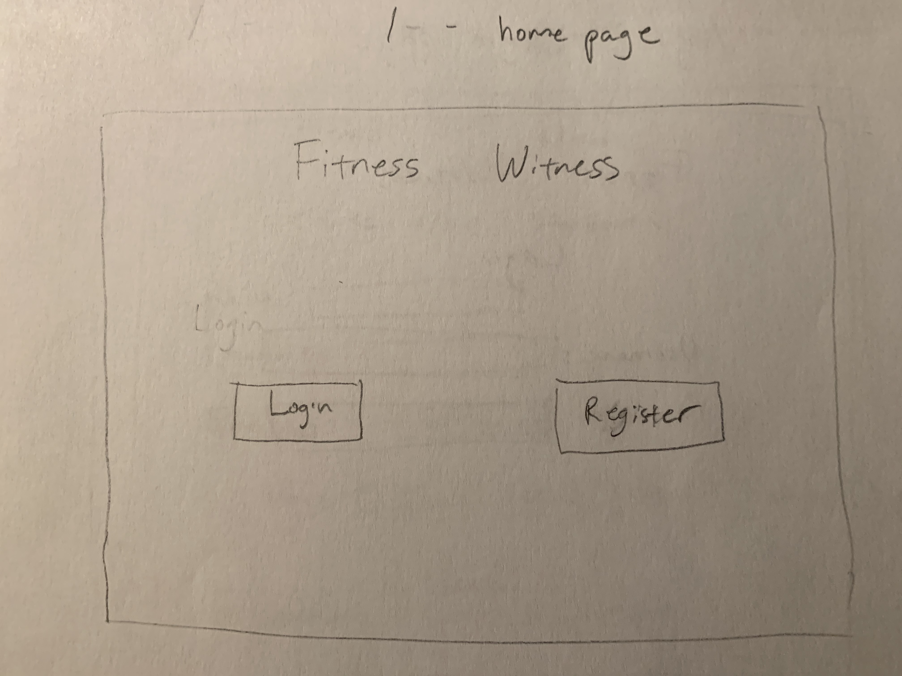
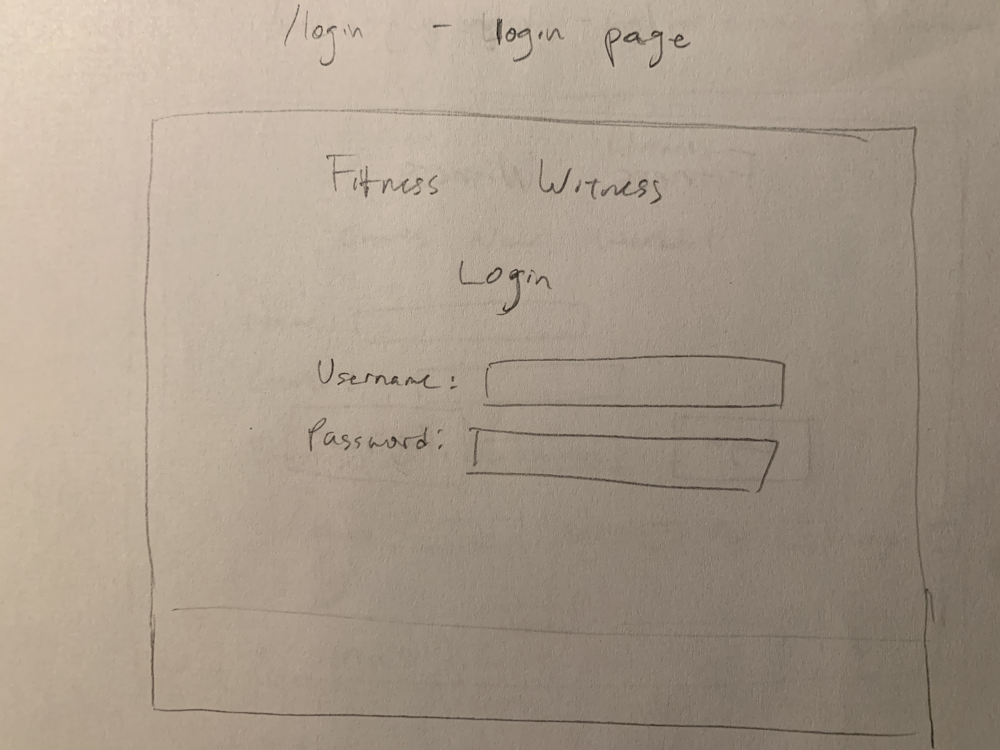
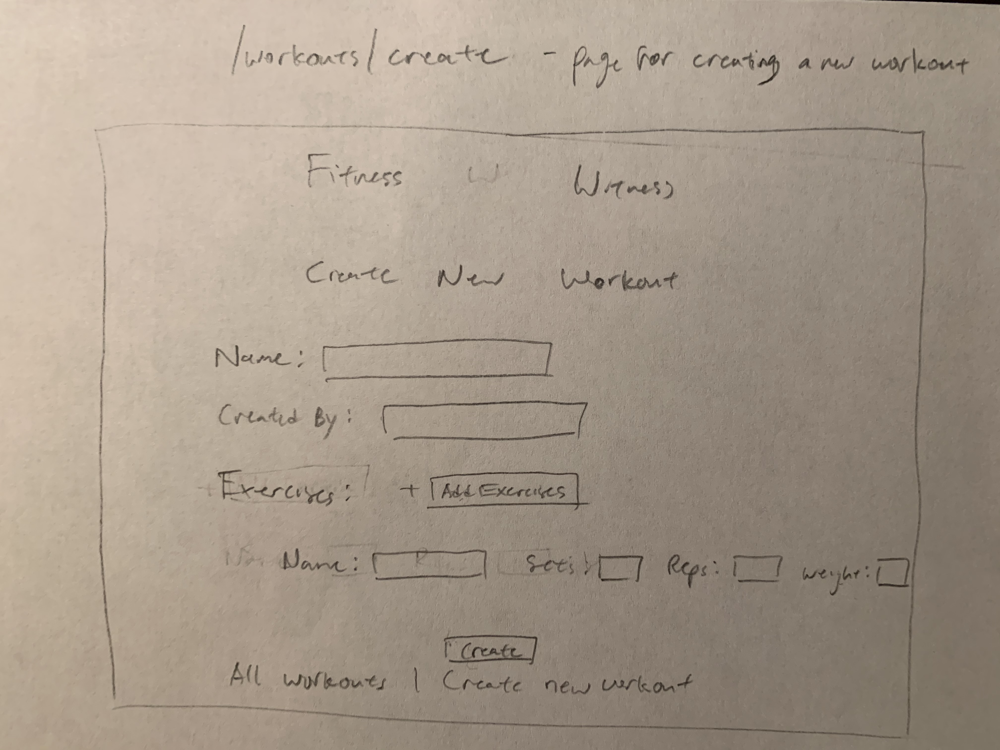
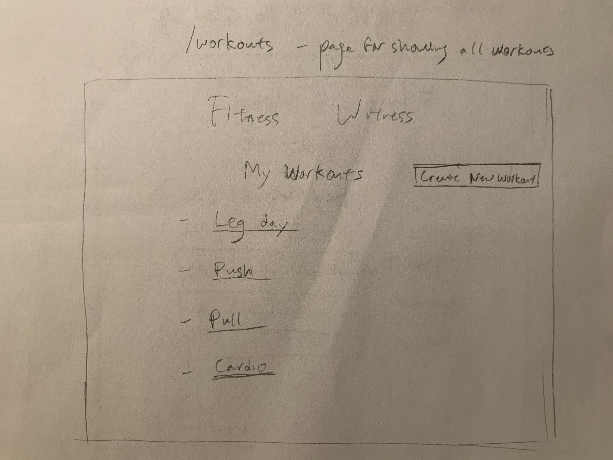
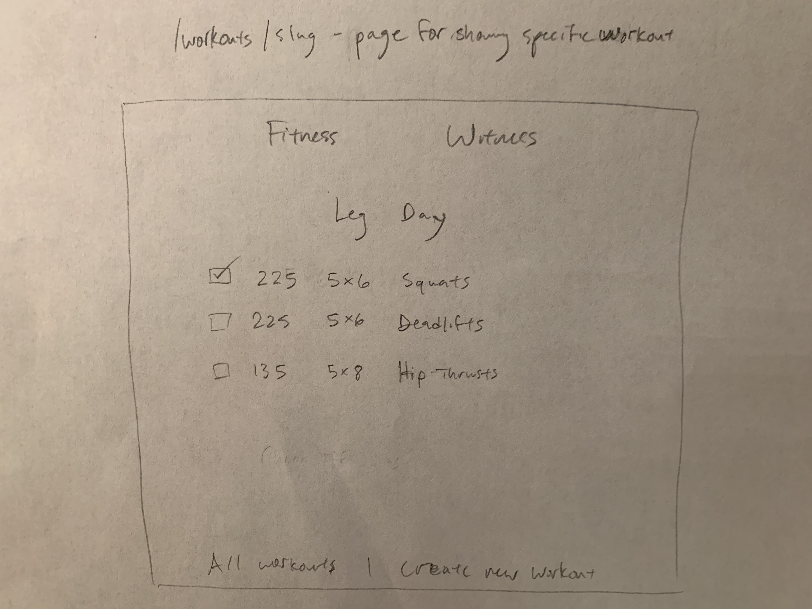
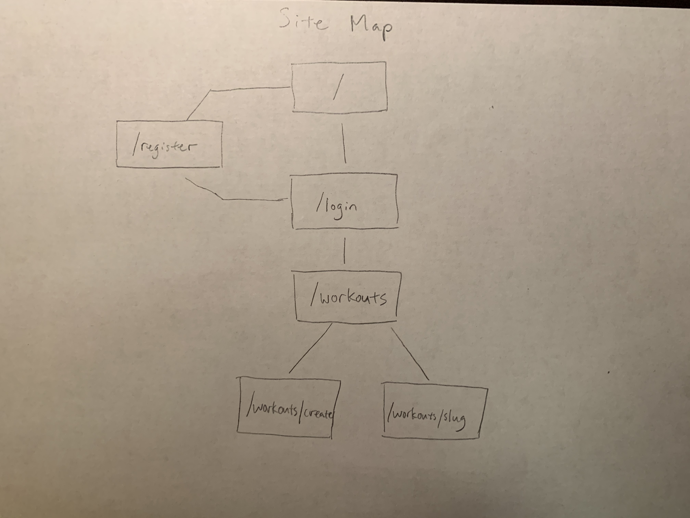

The content below is an example project proposal / requirements document. Replace the text below the lines marked "__TODO__" with details specific to your project. Remove the "TODO" lines.

(___TODO__: your project name_)

# Fitness Witness

## Overview

(___TODO__: a brief one or two paragraph, high-level description of your project_)

Keeping up with a regular habit of exercise is hard enough. Trying to remember new workouts and keeping track of old ones also wastes time and effort, when you could be using those precious minutes to maximize dem GAINZ. 💪

Fitness Witness is a web app that will allow users to keep track of their workout routines. Users can register and login. Once they're logged in, they can create and view their workout routines. As the users work out, they can select a routine and check off exercises as they go.

(Optional features:)
- Users can also add other users as friends and view their public workouts
- Users can also track their progress regarding body weight and strength (workout template, add variable weight/sets/reps during the workout)

## Data Model

(___TODO__: a description of your application's data and their relationships to each other_) 

The application will store Users, Workouts, and Exercises (maybe make Sets schema to customize reps/weight for each set)(Optional: Friends)

* users can have multiple workouts (via references)
* each workout can have multiple exercises (by embedding)

(___TODO__: sample documents_)

An Example User:

```javascript
{
  username: "reps4jesus",
  hash: // a password hash,
  workouts: // an array of references to Workout documents
}
```

An Example Workout with Embedded Exercises:

```javascript
{
  user: "Kshoes", // a reference to a User object
  name: "Leg Day",
  exercises: [
    { name: "squats", sets: 5, reps: 6, weight: 225, checked: true},  // weight in lbs
    { name: "deadlifts", sets: 5, reps: 6, weight: 225, checked: false},
    { name: "hip thrusts", sets: 5, reps: 8, weight: 135, checked: false}
  ],
  createdAt: // timestamp
}
```


## [Link to Commented First Draft Schema](src/db.js) 

(___TODO__: create a first draft of your Schemas in db.js and link to it_)

## Wireframes

(___TODO__: wireframes for all of the pages on your site; they can be as simple as photos of drawings or you can use a tool like Balsamiq, Omnigraffle, etc._)

/ - home page



/register - registration page


/login - login page



/workouts/create - page for creating a new workout



/workouts - page for showing all workouts



/list/slug - page for showing specific workout



## Site map

(___TODO__: draw out a site map that shows how pages are related to each other_)



## User Stories or Use Cases

(___TODO__: write out how your application will be used through [user stories](http://en.wikipedia.org/wiki/User_story#Format) and / or [use cases](https://www.mongodb.com/download-center?jmp=docs&_ga=1.47552679.1838903181.1489282706#previous)_)

1. as non-registered user, I can register a new account with the site
2. as a user, I can log in to the site
3. as a user, I can create a new workout
4. as a user, I can view all of the workouts I've created in a single list
5. as a user, I can add items to an existing workout
6. as a user, I can cross off exercises in an existing workout once I've completed them

## Research Topics

(___TODO__: the research topics that you're planning on working on along with their point values... and the total points of research topics listed_)  (Subject to change)

* (5 points) Integrate user authentication
    * I'm going to be using passport or parsley for user authentication
    * An account will be made for testing; I'll email/dm you the password
    * see <code>cs.nyu.edu/~kx360/ait-final/register</code> for register page
    * see <code>cs.nyu.edu/~kx360/ait-final/login</code> for login page
* (3 points) Perform client side form validation using a JavaScript library
    * see <code>cs.nyu.edu/~jversoza/ait-final/my-form</code>
    * if you put in a number that's greater than 5, an error message will appear in the dom

## [Link to Initial Main Project File](src/app.js) 

(___TODO__: create a skeleton Express application with a package.json, app.js, views folder, etc. ... and link to your initial app.js_)

## Annotations / References Used

(___TODO__: list any tutorials/references/etc. that you've based your code off of_)

1. [passport.js authentication docs](http://passportjs.org/docs) - (add link to source code that was based on this)

